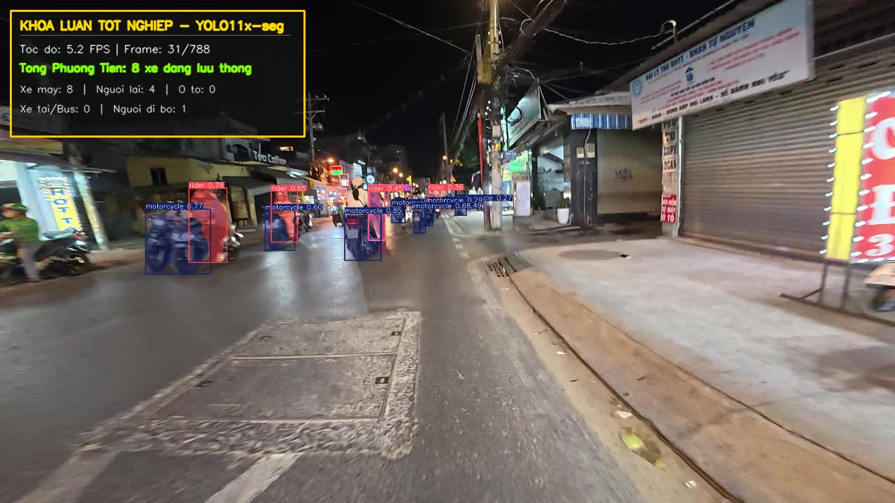
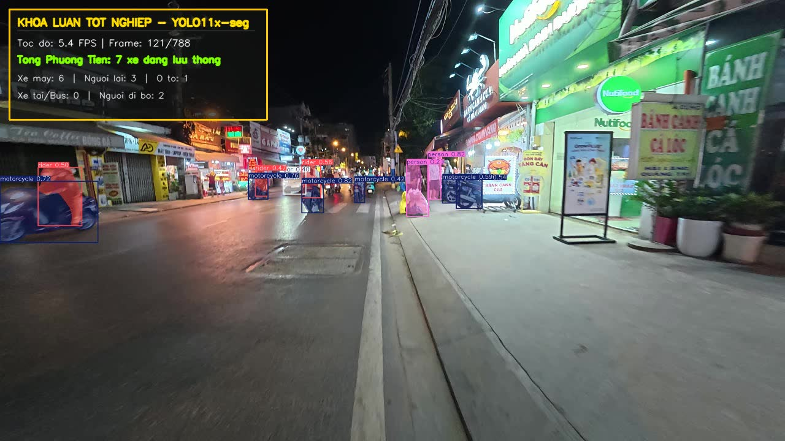
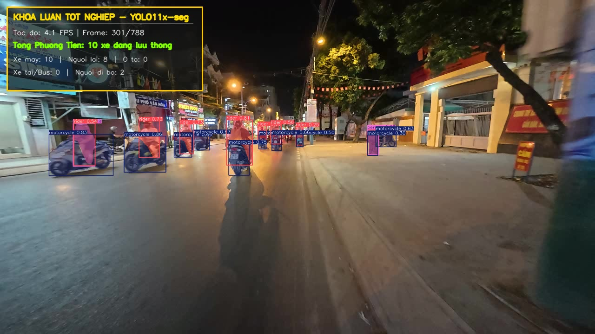

# VN-Traffic-Instance-Segmentation-YOLO11

Instance segmentation cho phương tiện và người tham gia giao thông tại Việt Nam, dùng YOLO11x-seg. Nhãn dữ liệu được tạo bán tự động bằng SAM 2 rồi hiệu chỉnh thủ công trên CVAT.

Đây là sản phẩm khóa luận tốt nghiệp tại Khoa CNTT, Trường Đại học Ngoại ngữ - Tin học TP.HCM (HUFLIT), thực hiện bởi Trang Tuấn Vinh và Nguyễn Hoàng Thuận, dưới sự hướng dẫn của ThS. Lã Như Hải.

## Demo


Video gốc (30 FPS và bản làm mượt 15 FPS) nằm trong thư mục [`demo/`](demo/). Video chạy trên đoạn giao thông thực tế quay tại Việt Nam, mô hình vẽ mask phân đoạn + bounding box theo thời gian thực, có bộ đệm deque để làm mượt số đếm đối tượng giữa các frame (tránh nhảy số khi mô hình bỏ sót 1-2 frame).

| Frame mẫu 1 | Frame mẫu 2 | Frame mẫu 3 |
|---|---|---|
|  |  |  |

## Bài toán

Hầu hết các bộ dữ liệu instance segmentation giao thông công khai (BDD100K, Cityscapes...) được thu thập ở Âu-Mỹ, mật độ phương tiện thấp và gần như không có xe máy — trong khi giao thông Việt Nam đặc trưng bởi mật độ xe máy rất cao, làn xe không rõ ràng, và nhiều loại phương tiện chen lẫn nhau trong cùng một khung hình. Mô hình huấn luyện trên dữ liệu nước ngoài khi áp vào video Việt Nam thường segment sai hoặc gộp nhầm các xe máy đứng sát nhau thành một đối tượng.

Dự án này xây dựng lại một bộ dữ liệu huấn luyện dựa trên BDD100K nhưng bổ sung thêm ảnh giao thông Việt Nam thật, sau đó huấn luyện và đánh giá YOLO11x-seg riêng cho bối cảnh này.

## Dữ liệu

- **Tập huấn luyện:** 9.500 ảnh — gồm 7.000 ảnh gốc + 2.000 ảnh gán nhãn bổ sung + 500 ảnh chụp thực tế tại Việt Nam.
- **Tập kiểm thử độc lập:** 1.247 ảnh giao thông Việt Nam, gán nhãn segmentation đầy đủ theo định dạng YOLO (polygon).
- **Quy trình gán nhãn:** SAM 2 sinh mask sơ bộ → hiệu chỉnh biên và gán lớp thủ công trên CVAT. Cách làm này giảm đáng kể thời gian gán nhãn thủ công so với vẽ polygon từ đầu.

10 lớp đối tượng:

| ID | Lớp | ID | Lớp |
|---|---|---|---|
| 0 | bicycle | 5 | person |
| 1 | bus | 6 | rider |
| 2 | car | 7 | trailer |
| 3 | caravan | 8 | train |
| 4 | motorcycle | 9 | truck |

Bộ dữ liệu (file zip ảnh + nhãn) không đưa vào repo này vì dung lượng lớn. Link tải: *(điền link Google Drive / Kaggle / HuggingFace Datasets của bạn tại đây)*.

## Kết quả

Huấn luyện 100 epoch, kết quả tốt nhất đạt tại epoch 52:

| Chỉ số | Giá trị |
|---|---|
| Mask mAP@50 | 33.31% |
| Mask mAP@50:95 | 18.43% |
| Box mAP@50 | 38.59% |
| Box mAP@50:95 | 26.33% |

Mask mAP@50:95 còn khiêm tốn — điều này khá hợp lý với đặc thù bài toán: mật độ xe máy dày đặc khiến biên các mask chồng lấn nhiều, và ngưỡng IoU nghiêm ngặt (0.5–0.95) phạt nặng những sai lệch nhỏ ở viền mask. Đường cong loss/mAP theo từng epoch nằm trong `results/` (xuất ra từ notebook huấn luyện).

## Kiến trúc & pipeline

```
Ảnh gốc (BDD100K + ảnh VN)
        │
        ▼
  SAM 2 (mask sơ bộ) ──► CVAT (hiệu chỉnh + gán lớp thủ công)
        │
        ▼
  data_docker.yaml (gộp images/test + images/vn_500 vào Train)
        │
        ▼
  YOLO11x-seg (pretrained → fine-tune, imgsz=640, batch=16, 100 epochs)
        │
        ▼
  best.pt ──► Inference trên video (OpenCV, deque smoothing) ──► video output
```

## Cấu trúc repo

```
.
├── notebooks/
│   ├── 01_train_yolo11_bdd100k_seg.ipynb   # cấu hình data, huấn luyện, xuất log, vẽ biểu đồ, validate
│   └── 02_test_video_inference.ipynb        # nạp best.pt, chạy trên video, xuất video kết quả
├── docs/
│   └── huong_dan_su_dung.pdf                # hướng dẫn cài đặt & vận hành chi tiết
├── results/
│   └── sample_predictions/                  # frame minh họa từ video demo
├── demo/
│   ├── demo.gif
│   ├── demo_real_time_30fps.mp4
│   └── demo_real_time_15fps.mp4
├── requirements.txt
└── README.md
```

## Cài đặt

Yêu cầu: Python 3.10–3.12. Khuyến nghị GPU NVIDIA ≥16GB VRAM để huấn luyện (RTX 3090/4090, Colab A100/L4...); ≥4GB VRAM hoặc CPU đủ để chạy inference.

```bash
git clone https://github.com/<username>/VN-Traffic-Instance-Segmentation-YOLO11.git
cd VN-Traffic-Instance-Segmentation-YOLO11
pip install -r requirements.txt
```

Nếu có GPU + CUDA 12.x:

```bash
pip install torch torchvision torchaudio --index-url https://download.pytorch.org/whl/cu121
```

## Sử dụng

1. Tải bộ dữ liệu từ link ở phần Dữ liệu, giải nén để có `data.yaml`.
2. Mở `notebooks/01_train_yolo11_bdd100k_seg.ipynb`, chỉnh đường dẫn dataset ở Section 1, chạy tuần tự để huấn luyện. Notebook tự sinh `data_docker.yaml`, log kết quả từng epoch ra `trainlog.txt`, và validate trên tập val 1.000 ảnh ở bước cuối.
3. Sau khi có `best.pt`, mở `notebooks/02_test_video_inference.ipynb`, sửa `MODEL_PATH` trỏ đến file weight và `VIDEO_DIR` trỏ đến thư mục video cần test, rồi chạy để xuất video có mask + bbox.

Chi tiết từng bước, kèm xử lý lỗi thường gặp (thiếu `data.yaml`, CUDA out of memory, thiếu module `ultralytics`), xem tại [`docs/huong_dan_su_dung.pdf`](docs/huong_dan_su_dung.pdf).

## Hạn chế & hướng phát triển

- Mask mAP còn thấp ở các lớp hiếm gặp trong ảnh Việt Nam (caravan, train) do số lượng mẫu ít.
- Video demo quay ban ngày, điều kiện ánh sáng tốt — chưa kiểm thử ban đêm/trời mưa.
- Hướng tiếp theo: mở rộng ảnh VN về đêm, thử fine-tune thêm với augmentation mô phỏng mưa/ngược sáng, và benchmark so với YOLO11-seg các size nhỏ hơn (n/s/m) để đánh giá đánh đổi tốc độ–độ chính xác cho triển khai edge.

## License

MIT — xem [LICENSE](LICENSE).
